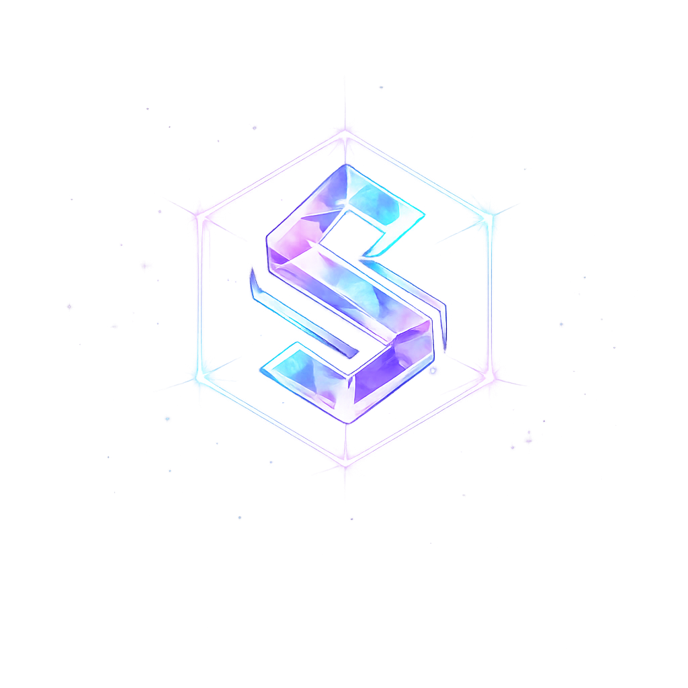

<!-- ═══════════════════════════════════════════════════════════ -->
<!-- HERO -->
<!-- ═══════════════════════════════════════════════════════════ -->

 

 

# S Y L V R O N

**Software · Games · Rail Tech**

 

  

> **Ich entwickle Software, die echte Probleme löst** — von Dienstplanung in für Kinderheime über Gleisplanungstools bis hin zu Indie Games und Roblox Games.

 

---

<!-- ═══════════════════════════════════════════════════════════ -->
<!-- ABOUT -->
<!-- ═══════════════════════════════════════════════════════════ -->

## 👤 Über mich

Hey, ich bin **BadFameZz** — Solo-Entwickler und Gründer von **Sylvron**. Ich arbeite an der Schnittstelle von **B2B-SaaS**, **Desktop-Anwendungen** und **Game Development**. Meine Projekte verbinden technische Tiefe mit praxisnahen Lösungen — ob für Kinderbetreuung, Eisenbahningenieure oder Gamer.

Wenn ich nicht programmiere, schreibe ich an meinem Fantasy-Roman oder bastle an Pixelkunst.

 

<!-- ═══════════════════════════════════════════════════════════ -->
<!-- PROJECTS -->
<!-- ═══════════════════════════════════════════════════════════ -->

## 🚀 Projekte

<table>
<tr>
<td width="50%" valign="top">

### 🗓️ Planvyr

**B2B SaaS — Dienstplanung für die Pflege**

Intelligente Dienstplanungs-Plattform, speziell entwickelt für **deutsche Kinderheime**. Deckt komplexe Schichtregeln, gesetzliche Vorgaben und Team-Koordination ab.

`TypeScript` `React` `Encore.dev` `PostgreSQL`

🔒 In Entwicklung — Private Beta

</td>
<td width="50%" valign="top">

### 🚆 Vialis

**Desktop App — Gleis- & Streckenplanung**

Professionelles Planungstool für Eisenbahninfrastruktur. Abdeckung von ETCS/ERTMS-Systemen, Signalplanung und Gleisgeometrie nach deutschen Bahnstandards.

`Svelte` `Tauri` `Rust`

Fertig

</td>
</tr>
<tr>
<td width="50%" valign="top">

### 👗 PixelRunway

**Game — Startup Tycoon**

Ein Startup-Tycoon-Simulationsspiel, in dem Spieler ihr eigenes Unternehmen von Grund auf aufbauen und managen. Strategische Entscheidungen treffen auf Pixel-Art-Ästhetik.

`Game Dev` `Pixel Art` `React` `Canvas`

🎮 In Konzeptphase

</td>
<td width="50%" valign="top">

### 🎲 DiceLegends

**Roblox — Dice & Wagering**

Ein Roblox Dice-/Wagering-Erlebnis, eigenem Shop-System mit Ingame-Währung (Taler) und persistenter Spieler-Progression via DataStore.

`Roblox` `Luau` `Game Design`

🎮 In Entwicklung

</td>
</tr>
</table>

 

<!-- ═══════════════════════════════════════════════════════════ -->
<!-- TECH STACK -->
<!-- ═══════════════════════════════════════════════════════════ -->

## 🛠️ Tech Stack

**Sprachen** 

**Frontend & Frameworks** 

**Backend & Infrastruktur** 

**Tools & Plattformen** 

 

<!-- ═══════════════════════════════════════════════════════════ -->
<!-- WRITING -->
<!-- ═══════════════════════════════════════════════════════════ -->

## ✍️ Kreativ-Ecke

<table>
<tr>
<td>
  <h3>📖 Lumilo: Hüter der Elemente</h3>
  

    Mein aktuelles Buchprojekt — ein <strong>Young-Adult-Fantasy-Roman</strong>, angesiedelt in der Welt von <em>Elarion</em>. Sechs rotierende Perspektiven erzählen die Geschichte elementarer Hüter. Der Ton beginnt warm und wird mit jedem Kapitel dunkler.
  

  
📝 In Arbeit — Deutsch

</td>
</tr>
</table>

 

<!-- ═══════════════════════════════════════════════════════════ -->
<!-- GITHUB STATS -->
<!-- ═══════════════════════════════════════════════════════════ -->

## 📊 GitHub Stats

&nbsp;&nbsp;

 

<!-- ═══════════════════════════════════════════════════════════ -->
<!-- FOOTER -->
<!-- ═══════════════════════════════════════════════════════════ -->

---

Solo gebaut mit ☕ in Sachsen-Anhalt, Deutschland

 

© 2026 Sylvron — Thomas

